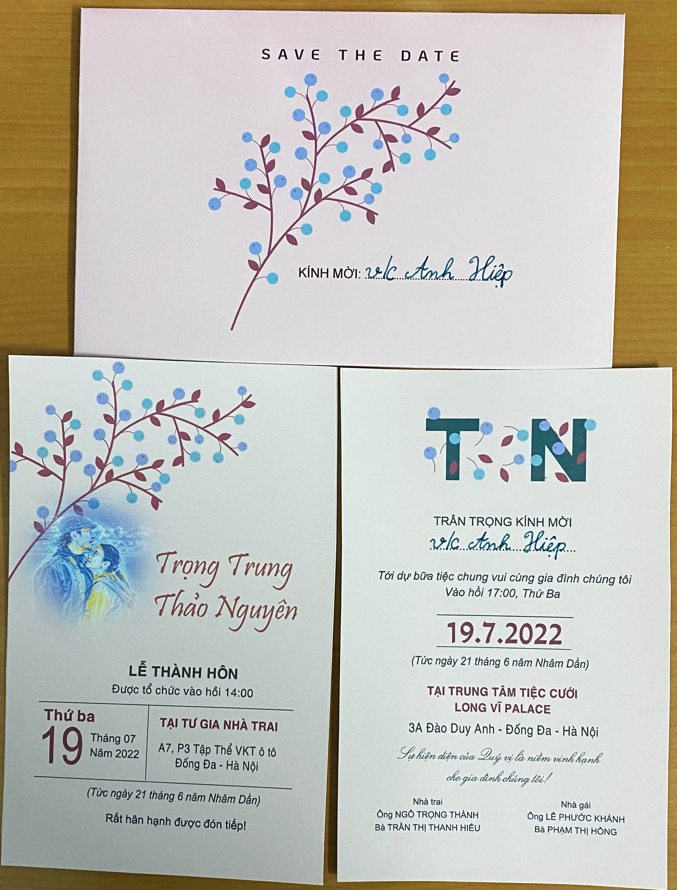
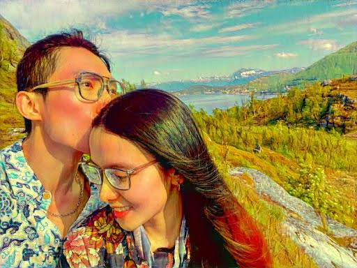
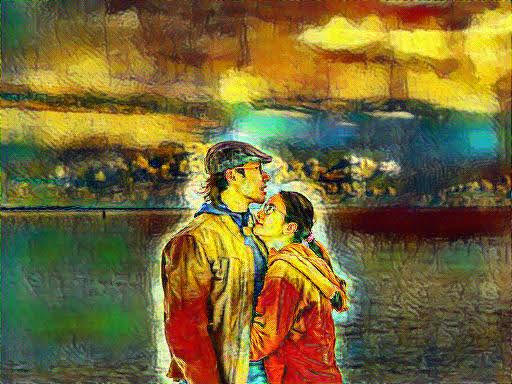
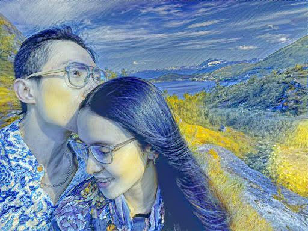
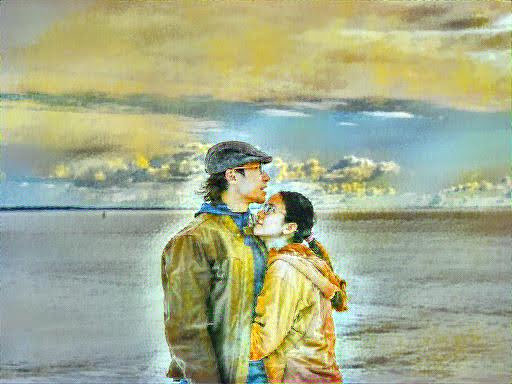
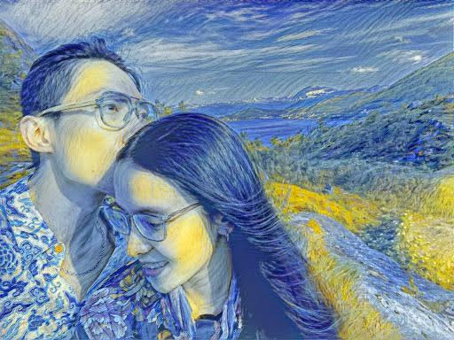
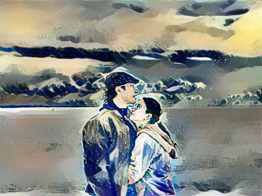
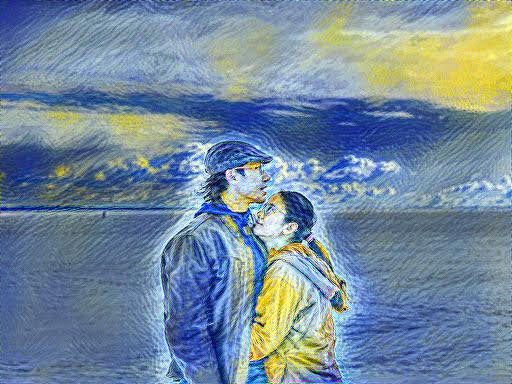

# Using Neural Style Transfer to create your wedding card

**Code and tutorial will be released soon**

### Some interesting results

| Style #2             |  Style #3 |
:-------------------------:|:-------------------------:
  |  
  |  
  |  
  |  
